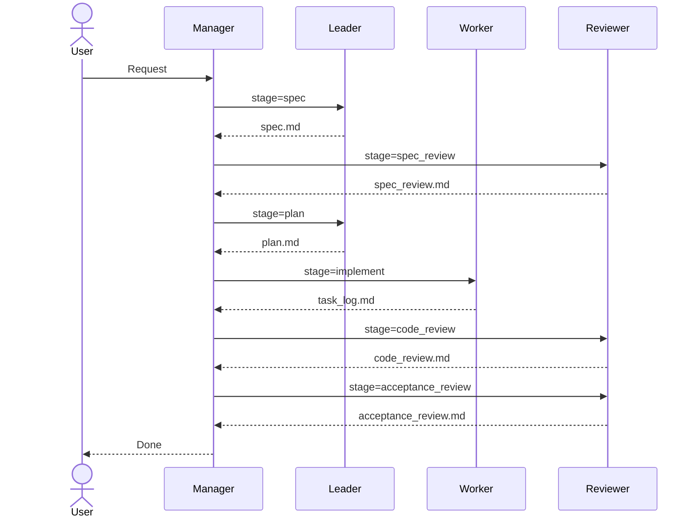

# Auto Implementation Plugin

## Overview

This directory summarizes the setup for automatic implementation using coordinated sub-agents. The manager controls stage transitions and delegates work to leader, worker, and reviewer. Each agent has strict responsibilities and output formats so artifacts are handed off consistently.

## Architecture

- Progress state is managed as a single source of truth in `.ai/project.json`.
- The user request, questions, and progress are recorded in `.ai/overview.md`.
- Each stage outputs artifacts under `.ai/artifacts/`.
- Only the manager updates `.ai/project.json` and `.ai/overview.md`.
- Other agents read the current stage and output only their assigned artifacts.

## Stage Flow

The process proceeds in the following order.

1. `overview` (manager): record the user request and manage the overall flow
2. `spec` (leader): create the specification
3. `spec_review` (reviewer): review the specification
4. `plan` (leader): create the implementation plan
5. `implement` (worker): implement and log the work
6. `code_review` (reviewer): review the code
7. `acceptance_review` (reviewer): acceptance review
8. `done` (manager): project completion

If a review is REJECTED, the process rolls back to the appropriate stage and repeats.

## Sequence Diagram

## Roles

### Manager

- Orchestrates the overall flow.
- Creates and updates `.ai/project.json` and `.ai/overview.md`.
- Notifies stage transitions and delegates work to other agents.
- Does not make technical decisions, plans, or reviews.

### Leader

- Creates the specification from the user request.
- Produces the implementation plan based on the specification.
- Uses repository search and web research when needed.
- Does not perform reviews; communication goes through the manager.

### Worker

- Implements the tasks listed in the plan.
- Runs tests and static analysis after implementation.
- Records decisions and execution logs in `.ai/artifacts/task_log.md`.
- Does not interpret specs or ask questions; decisions are logged and work continues.

### Reviewer

- Handles specification, code, and acceptance reviews.
- Outputs review artifacts with explicit APPROVED / REJECTED status.
- Focuses on security, quality, and acceptance criteria.

## Key Artifacts

- `.ai/project.json`: single source of truth for stage, owner, and status
- `.ai/overview.md`: request, questions, and progress log
- `.ai/artifacts/spec.md`: specification (leader)
- `.ai/artifacts/spec_review.md`: specification review (reviewer)
- `.ai/artifacts/plan.md`: implementation plan (leader)
- `.ai/artifacts/task_log.md`: implementation log (worker)
- `.ai/artifacts/code_review.md`: code review (reviewer)
- `.ai/artifacts/acceptance_review.md`: acceptance review (reviewer)
